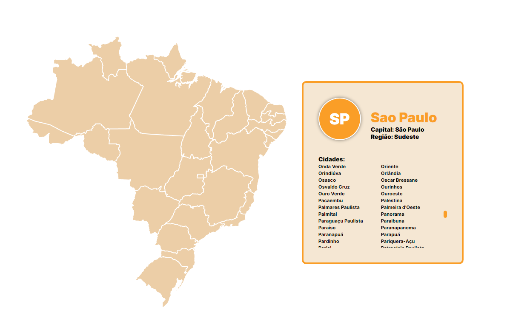

# API De Estados

---

## Sobre
Site criado pensando em uma copia do Whatsapp Web.

O objetivo deste projeto é colocar em prática os conhecimentos adquiridos em aula no curso de Desenvolvimento de Sistemas do [SENAI Jandira](https://jandira.sp.senai.br/).

---
## Tecnologias utilizadas
- Figma
- HTML5
- CSS3
- JS
- Markdown
- JSON

---
## Autor
- [Cauã Felipe](https://github.com/alemao148)

---
## Links
- [Github]()

